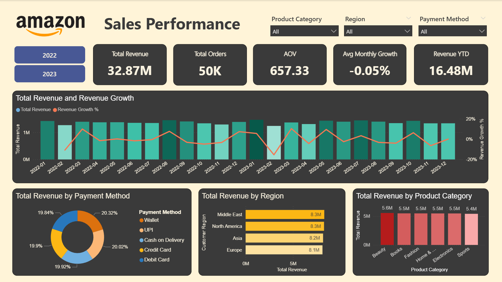

# 📦 Amazon Sales Performance Analysis (2022–2023)

---

## 📑 Data Source

Dataset sourced from Kaggle:
**[Amazon Sales Dataset — by Aliii Hussain](https://www.kaggle.com/datasets/aliiihussain/amazon-sales-dataset)**

## 📌 Overview

This project presents an end-to-end analysis of Amazon's sales performance data spanning **2022 to 2023**. Using Python for data cleaning and exploratory data analysis (EDA), alongside an interactive Power BI dashboard, this project uncovers trends in revenue, customer behavior, regional distribution, and product performance to support data-driven business decisions.

**Key Metrics at a Glance:**

| Metric | Value |
|---|---|
| Total Revenue | $32.87M |
| Total Orders | 50K |
| Average Order Value (AOV) | $657.33 |
| Avg Monthly Growth | -0.05% |
| Revenue YTD | $16.48M |

---

## 🗂️ Background

E-commerce platforms like Amazon generate vast amounts of transactional data on a daily basis. Understanding sales patterns, customer preferences, and payment behavior is critical for strategic planning and performance optimization.

This analysis is based on the `amazon_sales_dataset.csv`, which contains order-level data including:
- **Order date** — timestamp of each transaction
- **Product category** — type of product sold (Beauty, Books, Fashion, Home & Kitchen, Electronics, Sports)
- **Customer region** — geographic region of the buyer (Asia, Europe, Middle East, North America)
- **Payment method** — mode of payment used (Wallet, UPI, Cash on Delivery, Credit Card, Debit Card)
- **Price & Discounted Price** — original and final selling price
- **Total Revenue** — revenue generated per order

The dataset covers **2 fiscal years (2022–2023)** and includes **50,000 transactions** across multiple regions and product categories.

---

## 🔍 Exploratory Data Analysis (EDA)

The EDA pipeline was implemented in Python using `pandas`, `numpy`, `matplotlib`, and `seaborn`.

### A. Data Cleaning

Before analysis, the following cleaning steps were performed:

- **Duplicate Check** — Scanned and removed any duplicate rows to ensure data integrity.
- **Missing Value Handling** — Verified that all columns had no null/missing values.
- **Data Type Correction** — Converted the `order_date` column from `object` to `datetime` format for time-series analysis.

### B. Feature Engineering

New features were derived from existing columns to enrich the analysis:

- **Temporal Features** — Extracted `year`, `month`, and `day_name` from `order_date` to enable time-based aggregations.
- **Discount Amount** — Computed as `price - discounted_price` to quantify the discount given per order.

### C. EDA & Visualizations

### 1. Variable Correlation Analysis
A heatmap of the correlation matrix across all numerical features was generated to identify relationships between variables such as price, quantity, discount, and total revenue.


### 2. Revenue by Product Category
A horizontal bar chart visualized total revenue per product category, revealing which categories drive the most sales.


### 3. Sales Trend Over Time
A monthly time-series line chart tracked revenue fluctuations from January 2022 to December 2023, highlighting seasonal peaks and troughs.


### 4. Customer Shopping Activity by Day of Week
A count plot analyzed transaction frequency across each day of the week to identify peak shopping days.


---
## 📊 Dashboard Overview



---

## 💡 Key Business Insights

### 1. 📅 Revenue Trend is Relatively Stable, but Growth is Stagnant
Monthly revenue hovers around **~$1M** throughout both years, with an average monthly growth rate of **-0.05%**. This flat trend suggests the business has reached a plateau and requires growth-oriented strategies to drive meaningful revenue increases.

### 2. 🛍️ Product Categories are Nearly Equally Distributed
All six product categories — **Beauty, Books, Fashion, Home & Kitchen, Electronics, and Sports** — contribute similarly to total revenue, ranging from **$5.4M to $5.6M**. This indicates a well-diversified product portfolio with no single dominant category.

### 3. 🌍 Revenue is Balanced Across Regions
All four regions — **Middle East ($8.3M), North America ($8.3M), Asia ($8.2M), and Europe ($8.1M)** — contribute almost equally to total revenue. This reflects strong global reach with consistent market penetration across geographies.

### 4. 💳 Payment Methods are Evenly Split
No single payment method dominates: **Wallet (20.32%), Credit Card (20.02%), Debit Card (19.92%), Cash on Delivery (19.90%), and UPI (19.84%)** are all nearly equally preferred. This suggests customers have diverse payment preferences, and supporting all channels is critical to avoid losing sales.

### 5. 📉 Notable Revenue Dip in February 2023
A visible dip in revenue occurred in **February 2023**, which may correlate with seasonal factors, lower promotional activity, or supply chain disruptions. This warrants further investigation.

---

## ✅ Conclusion & Solutions

The Amazon Sales Performance analysis reveals a **stable but stagnant business** with strong diversification across products, regions, and payment methods. While the balanced distribution across dimensions is a sign of resilience, the near-zero monthly growth rate (-0.05%) signals an urgent need for strategic interventions.

---

### 🔴 Problem 1: Stagnant Revenue Growth (-0.05% Monthly)

**Root Cause:** No significant increase in new customers, order volume, or average order value over the 2-year period.

**Solutions:**
- 🎯 **Flash Sales & Limited-Time Deals** — Run aggressive time-limited promotions (e.g., 48-hour deals) to create urgency and spike order volume.
- 👥 **Customer Acquisition Campaigns** — Invest in paid ads targeting new customer segments, particularly in high-potential demographics.
- 🔁 **Loyalty & Retention Program** — Introduce a reward points system to incentivize repeat purchases and increase purchase frequency per customer.
- 📦 **Bundle Offers** — Package complementary products (e.g., Electronics + accessories) to increase Average Order Value (AOV) beyond the current $657.33.

---

### 🔴 Problem 2: Revenue Dip in February 2023

**Root Cause:** Post-holiday slowdown with no promotional activity to sustain momentum.

**Solutions:**
- 💝 **Valentine's Day Campaign** — Capitalize on February's Valentine's Day with targeted promotions on Beauty, Fashion, and Books categories.
- 🏷️ **Off-Season Discounts** — Offer exclusive discounts in slow months to maintain customer engagement and prevent revenue from dropping below the monthly average.
- 📧 **Email & Push Notification Re-engagement** — Target dormant customers with personalized offers during low-traffic periods to bring them back.

---

### 🔴 Problem 3: No Dominant Product Category

**Root Cause:** Revenue is spread almost equally across all 6 categories ($5.4M–$5.6M), indicating no hero product driving outsized growth.

**Solutions:**
- 🔍 **Subcategory Deep Dive** — Analyze subcategory-level data to identify the top-performing products within each category and scale their visibility.
- ⭐ **Featured & Sponsored Listings** — Promote top-selling products in high-visibility placements (homepage banners, search top results).
- 📈 **Category-Specific Growth Targets** — Set differentiated growth targets per category based on market demand and margin potential.

---

### 🔴 Problem 4: Balanced but Untapped Regional Revenue

**Root Cause:** All regions contribute equally (~$8.1M–$8.3M), suggesting no region is being actively optimized for growth.

**Solutions:**
- 🌏 **Region-Specific Marketing** — Tailor promotions to local culture and events (e.g., Ramadan deals for Middle East, Black Friday for North America).
- 🚚 **Localized Logistics & Delivery** — Improve delivery speed and reduce shipping costs in high-potential regions to drive conversion rates.
- 🌐 **Language & Currency Localization** — Personalize the shopping experience by offering local language support and regional currency pricing.

---

### 🔴 Problem 5: Payment Method Fragmentation

**Root Cause:** No payment method exceeds 21% share, which while inclusive, makes it harder to optimize checkout experiences.

**Solutions:**
- 💰 **Payment-Specific Cashback Offers** — Partner with digital wallet providers (e.g., offer 5% cashback for Wallet payments) to shift volume toward lower-cost payment methods.
- ⚡ **One-Click Checkout** — Streamline the payment experience for preferred methods to reduce cart abandonment.
- 🤝 **Buy Now Pay Later (BNPL)** — Introduce BNPL options to attract price-sensitive customers and increase AOV.

---

## 🛠️ Tech Stack

| Tool | Purpose |
|---|---|
| Python (pandas, numpy) | Data cleaning & feature engineering |
| Matplotlib & Seaborn | EDA visualizations |
| Power BI | Interactive sales dashboard |
| Jupyter Notebook | Analysis environment |

---

## 📁 Project Structure

```
amazon_sales_performance/
│
├── data/
│   └── amazon_sales_dataset.csv
│
├── notebooks/
│   └── data_cleaning_and_eda.ipynb
│
├── dashboard/
│   └── amazon_sales_performance.pbix
│
└── README.md
```

---

> **Author:** *Muh. Salim Maulana*
> **Last Updated:** April 2026
